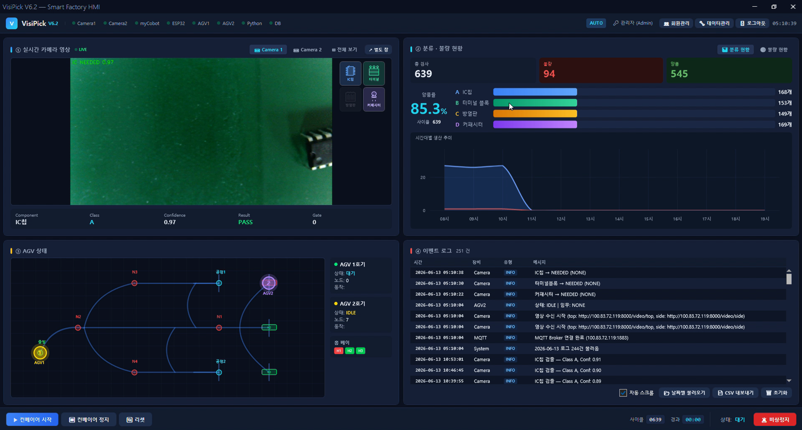
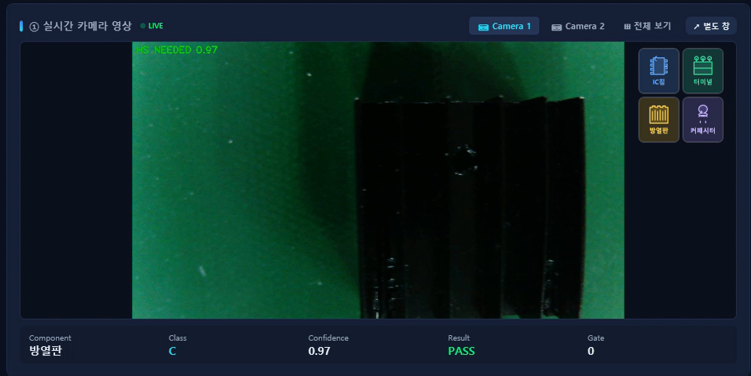

# 🏭 실시간 영상을 분석한 제품 자동 정렬 및 분류 시스템


YOLO, OpenCV, WPF, MQTT, ESP32 AGV 기반 제품 자동 정렬 및 분류 기능을 통합한 스마트팩토리 자동화 시스템입니다.

---

## 📌 프로젝트 소개

본 프로젝트는 스마트팩토리 환경을 가정하여,
실시간 카메라 영상을 분석해 제품을 자동으로 정렬하고 분류하는 시스템입니다.

카메라에서 수집한 영상을 YOLO 및 OpenCV 기반으로 분석하여 제품 종류와 상태를 판별하고,
분류 결과에 따라 트레이 적재 상태, 생산 현황, AGV 이송 상태를 WPF HMI에서 실시간으로 확인할 수 있도록 구현했습니다.

또한 MQTT 기반 실시간 데이터 연동 구조를 적용하여 카메라 분석 결과, AGV 상태, 이벤트 로그를 화면에 반영했으며,
SQLite 기반 데이터 저장 기능을 통해 검사 결과, 이벤트 로그, AGV 이력을 관리할 수 있도록 구성했습니다.

---

## 📅 프로젝트 정보

* 개발 기간: 2026.05.12 ~ 2026.06.19
* 개발 형태: 팀 프로젝트
* 개발 인원: 5명
* 개발 환경: Visual Studio, Visual Studio Code, Arduino IDE

---

## 🧩 시스템 구성

* Camera Vision System
* YOLO / OpenCV 기반 제품 분류 모듈
* WPF HMI 모니터링 시스템
* MQTT 기반 실시간 데이터 연동
* SQLite 기반 데이터 저장 모듈
* ESP32 기반 AGV 제어 시스템
* RFID / 초음파 센서 기반 AGV 주행 보조 모듈

---

## 🔄 시스템 흐름

1. 카메라에서 제품 영상을 수집
2. YOLO 및 OpenCV 기반으로 제품 종류와 상태 분석
3. 분석 결과를 MQTT 메시지로 WPF HMI에 전송
4. WPF HMI에서 생산 현황, 검사 결과, 트레이 상태, AGV 상태를 실시간 표시
5. 검사 결과와 이벤트 로그를 SQLite 데이터베이스에 저장
6. AGV가 목적지 명령을 수신한 뒤 라인트레이싱 기반으로 이동
7. RFID 태그를 통해 분기점과 창고 위치 인식
8. AGV 상태와 이동 결과를 MQTT로 다시 HMI에 반영

---

## 🛠 기술 스택

| 구분            | 내용                                             |
| ------------- | ---------------------------------------------- |
| Language      | C#, C++, Python                                |
| Framework     | WPF, .NET, FastAPI                             |
| AI / Vision   | YOLO, OpenCV                                   |
| Communication | MQTT, HTTP, REST API                           |
| Database      | SQLite                                         |
| Hardware      | ESP32, AGV, RFID, Ultrasonic Sensor            |
| Library       | LiveChartsCore, MahApps.Metro, OpenCvSharp     |
| IDE           | Visual Studio, Visual Studio Code, Arduino IDE |

---

## 💡 주요 기능

### 🎥 실시간 영상 분석

* 카메라 기반 제품 영상 수집
* YOLO 기반 제품 종류 판별
* OpenCV 기반 객체 및 트레이 상태 분석
* 제품 분류 결과 실시간 전송
* 정상 / 불량 상태 판단 결과 표시

### 🖥 WPF HMI 모니터링

* 생산 현황 및 검사 결과 실시간 표시
* 카메라 영상 출력
* 트레이 적재 상태 시각화
* AGV 위치 및 상태 시각화
* 이벤트 로그 실시간 출력
* 관리자 / 작업자 권한 분리
* 검사 결과 조회 및 판정 수정 기능
* CSV 파일 내보내기 기능

### 🚗 AGV 제어 시스템

* ESP32 기반 AGV 라인트레이싱 주행
* RFID 태그 기반 분기점 및 창고 위치 인식
* 초음파 센서 기반 장애물 감지
* 목적지에 따른 AGV 이동 경로 처리
* MQTT 기반 AGV 상태 전송
* HMI 화면에서 AGV 위치 및 상태 실시간 확인

### 🗄 데이터 저장 및 관리

* SQLite 기반 검사 결과 저장
* 이벤트 로그 저장
* AGV 주행 기록 저장
* 생산 수량 및 불량률 집계
* 관리자 화면 기반 데이터 조회
* CSV 기반 생산 데이터 저장

---

## 👨‍💻 구현 내용

* C# WPF 기반 HMI 화면 구현
* MVVM 구조 기반 화면 및 데이터 바인딩 구성
* MQTT 기반 실시간 데이터 수신 및 UI 반영
* SQLite 기반 검사 결과, 이벤트 로그, AGV 기록 저장 기능 구현
* LiveChartsCore 기반 생산 통계 및 불량률 시각화
* REST API 기반 Start / Stop / E-Stop 제어 연동
* ESP32 기반 AGV 라인트레이싱 주행 구현
* RFID 태그 기반 AGV 목적지 및 분기점 인식 구현
* 초음파 센서 기반 장애물 감지 기능 구현
* JSON 형식 AGV 상태 데이터 송수신 기능 구현

---

## 🙋 담당 역할

* WPF HMI 전체 화면 개발
* 로그인 및 권한별 화면 접근 구조 구현
* 대시보드, 카메라, AGV, 생산 현황, 관리자 데이터 관리 화면 구현
* MQTT 수신 데이터를 WPF UI에 실시간 반영
* SQLite 기반 검사 결과 및 이벤트 로그 저장 구조 구현
* CSV 데이터 내보내기 기능 구현
* ESP32 기반 AGV 라인트레이싱 펌웨어 수정 및 테스트
* RFID 태그 기반 AGV 분기점 및 목적지 인식 구조 구현
* 초음파 센서 기반 장애물 감지 기능 구현
* HMI와 AGV 상태 연동 및 시각화 구현

---

## ⚙️ 문제 해결 경험

### 🚗 AGV 주행 제어 및 WPF 실시간 상태 연동 문제

* 곡선 구간에서 AGV가 라인을 안정적으로 추종하지 못하는 문제가 발생
* 8채널 라인트레이싱 센서 조건값과 회전 시간을 조정하여 주행 안정성 개선
* RFID 태그 인식 위치와 노드 매핑을 수정하여 분기점 및 창고 위치 인식 정확도 개선
* MQTT 수신 데이터를 기반으로 WPF 화면에서 AGV 위치와 상태가 실시간으로 반영되도록 구현

### 🎥 카메라 인식 결과와 트레이 상태 시각화 문제

* 카메라 인식 결과만으로는 제품의 실제 적재 위치를 직관적으로 확인하기 어려운 문제가 발생
* 제품 판별 결과를 트레이 상태 데이터와 연결하여 HMI 화면에서 제품별 적재 상태를 시각화
* 생산 현황, 검사 결과, 트레이 상태를 함께 표시하여 전체 공정 흐름을 한 화면에서 확인할 수 있도록 개선

### 🖥 MQTT 수신 데이터 UI 반영 문제

* MQTT 콜백에서 수신한 데이터를 WPF UI에 바로 반영할 때 UI 스레드 접근 문제가 발생
* Dispatcher를 사용하여 UI 스레드에서 화면 값이 갱신되도록 처리
* 실시간 수신 데이터가 대시보드, AGV 화면, 이벤트 로그에 안정적으로 반영되도록 개선

---

## 🧠 설계 포인트

* WPF MVVM 기반 HMI 화면 구조 설계
* MQTT 기반 실시간 장비 상태 데이터 연동 구조 설계
* 카메라 영상 분석 결과와 트레이 상태 데이터 연결 구조 설계
* ESP32 AGV와 RFID 태그 기반 목적지 이동 흐름 구성
* SQLite 기반 검사 결과 및 이벤트 로그 관리 구조 설계
* 관리자 / 작업자 권한에 따른 화면 접근 구조 설계

---

## 🚀 프로젝트 특징

* 영상 분석, HMI, AGV 제어, 데이터 저장 기능을 하나의 시스템으로 통합
* WPF 기반 생산 현황 및 장비 상태 실시간 모니터링 구현
* MQTT 기반 장비 상태 데이터 송수신 구조 설계
* ESP32 AGV와 RFID 태그를 활용한 목적지 기반 이송 구조 구현
* SQLite 기반 검사 결과 및 이벤트 로그 관리 기능 포함
* 생산 현황, 검사 결과, 트레이 상태, AGV 상태를 한 화면에서 확인 가능한 통합 대시보드 구현

---

## 📁 프로젝트 구조

```text
real-time-video-based-product-sorting-and-classification-system/

├── wpf-hmi/                    # WPF 기반 HMI 프로그램
│   ├── Assets/                 # 이미지 및 UI 리소스
│   ├── Data/                   # 데이터 관련 파일
│   ├── Models/                 # 데이터 모델
│   ├── Services/               # MQTT, REST, SQLite 연동
│   ├── ViewModels/             # 화면별 데이터 처리
│   ├── MainWindow.xaml         # 메인 대시보드 화면
│   ├── LoginWindow.xaml        # 로그인 화면
│   ├── AllCameraView.xaml      # 카메라 전체 보기 화면
│   ├── SiteCameraWindow.xaml   # 현장 카메라 화면
│   ├── AdminDataWindow.xaml    # 관리자 데이터 관리 화면
│   ├── UserManagementWindow.xaml
│   ├── VisiPickHMI.csproj
│   └── VisiPickHMI.sln
│
├── agv-firmware/               # ESP32 기반 AGV 제어 코드
│   └── esp32_agv_firmware.ino  # 라인트레이싱, RFID, 초음파 센서 제어
│
├── .gitignore
└── README.md
```

---

## 🎥 시연 영상

시연 영상은 추후 업로드 예정입니다.

---

## 📷 실행 화면

### 🖥 통합 대시보드

생산 현황, 검사 결과, 카메라 영상, AGV 상태, 이벤트 로그를 한 화면에서 확인할 수 있는 화면입니다.



---

### 🎥 카메라 모니터링 화면

실시간 영상 분석 결과와 제품 분류 상태를 확인할 수 있는 화면입니다.



---

### 🚗 AGV 상태 화면

AGV의 이동 경로, 목적지, 현재 상태를 실시간으로 확인할 수 있는 화면입니다.


---

### 📊 생산 현황 화면

제품별 생산 수량, 정상 수량, 불량 수량, 불량률을 시각적으로 확인할 수 있는 화면입니다.


---

### 🗄 관리자 데이터 관리 화면

검사 결과, 이벤트 로그, AGV 기록을 조회하고 CSV 파일로 저장할 수 있는 화면입니다.


